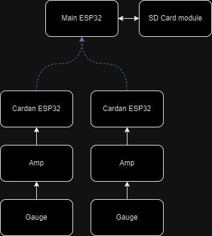

# Esp32 Cardan
Code pour les capteurs des cardans.


### Client
Le code du client est celui qui vas dans les ESP32 sur les cardans. Il permet de lire l'entré analogue de l'amplificateur et de l'envoyer au server. Pour différencier les ESP32, il faut changer le ``data.flags = (numero du esp que l'on souhaite)``.
### Server
Le code du server est pour le ESP32 sur le Baja. Il reçoit les données des capteurs sur les cardans.
### Setup
Chaque ESP32 a une adresse MAC unique, pour la déterminer il suffit d'upload le code de setup. Ceci est important pour savoir lequel des ESP32 est le server.

### Libraries
Changer l'adresses MAC du server:
```
constexpr uint8_t server_address[] = {0xFC, 0xB4, 0x67, 0xF5, 0x68, 0x20};
```
Ensuite pour pouvoir compiler le code du client et du server, il faut copier coller la librarie dans le folder des libraries Arduino ou mettre ``DataStructure.h`` dans le folder du sketch.

## Futur
- [ ] Mettre un syteme d'erreur mieux.<br/>
- [ ] Transmettre les données de facons a en perde aucune.<br/>

### Resources
Vidéo utilisé pour faire le code et comprendre comment ESP-NOW fonctionne: <br/>
 - [ESP-NOW - Peer to Peer ESP32 Network](https://www.youtube.com/watch?v=bEKjCDDUPaU&ab_channel=DroneBotWorkshop)
