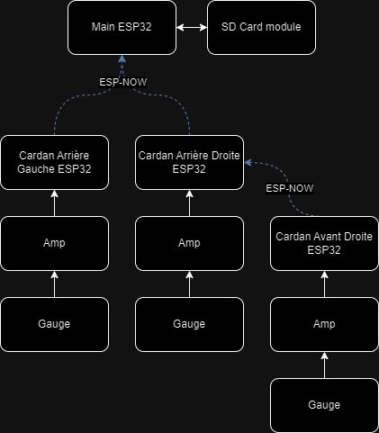

# Esp32 Cardan
Code pour les capteurs des cardans.


### Client
Le code du client est celui qui vas dans les ESP32 sur les cardans avant. Il permet de lire l'entré analogue de l'amplificateur et de l'envoyer au broadcaster.
### Server
Le code du server est pour le ESP32 sur le Baja. Il reçoit les données des capteurs sur les cardans.
### Broadcaster
Le code du broadcaster est celui qui vas dans les ESP32 sur les cardans arrière. Il permet de lire l'entré analogue de l'amplificateur et de l'envoyer à l'esp du server. De plus, il fait un pont entre le server et les ESP32 des cardans avant pour avoir une meilleur connection en évitant que les ondes passent par le firewall. (À tester)
### Setup
Chaque ESP32 a une adresse MAC unique, pour la déterminer il suffit d'upload le code de setup. Ceci est important pour savoir lequel des ESP32 est le server et où se situe les ESP32 sur le baja (arrière, devant, droite, gauche).
### LED
On définit 3 LED de couleur variables (RGB) qui ont pour fonction de nous indiquer différents états du système. <br/>
<br/>
sdLED: indique l'état du lecteur de carte SD <br/>
--> vert: Lecture terminée, aucun problème rencontré <br/>
--> jaune: Enregistrement en cours <br/>
--> rouge: Problème rencontré, enregistrement interrompu ou non commencé <br/>
<br/>
commLED: indique l'état de la communication entres les cardans <br/>
-->vert: tout fonctionne <br/>
-->jaune: fonctionnement partiel des communications <br/>
-->rouge: communication complètement planté <br/>
<br/>
GPSLED: indique l'état du GPS <br/>

### Libraries
Changer les adresses MAC suivante:
```
constexpr uint8_t client_address[] = {0x84, 0xCC, 0xA8, 0x61, 0x01, 0x4C};
constexpr uint8_t server_address[] = {0xFC, 0xB4, 0x67, 0xF5, 0x68, 0x20};

//Il est important de mettre l'addresse du ESP qui est directement en arriere de lui
constexpr uint8_t broadcaster_address[] = {0x84, 0xCC, 0xA8, 0x60, 0xCC, 0xE4};
```
Ensuite pour pouvoir compiler le code du Broadcaster, Client et Server, il faut copier coller la librarie dans le folder des libraries Arduino.

## Futur
- [ ] Mettre un syteme d'erreur mieux.<br/>
- [ ] Enlever les serials prints.<br/>
- [ ] Logger sur la carte SD avec le server.<br/>
- [ ] Tester avec 4 ESP32.<br/>
- [ ] Tester si les ESP32 en avant peuvent bien transmettre les donnes.<br/>

### Resources
Vidéo utilisé pour faire le code et comprendre comment ESP-NOW fonctionne: <br/>
 - [ESP-NOW - Peer to Peer ESP32 Network](https://www.youtube.com/watch?v=bEKjCDDUPaU&ab_channel=DroneBotWorkshop)
